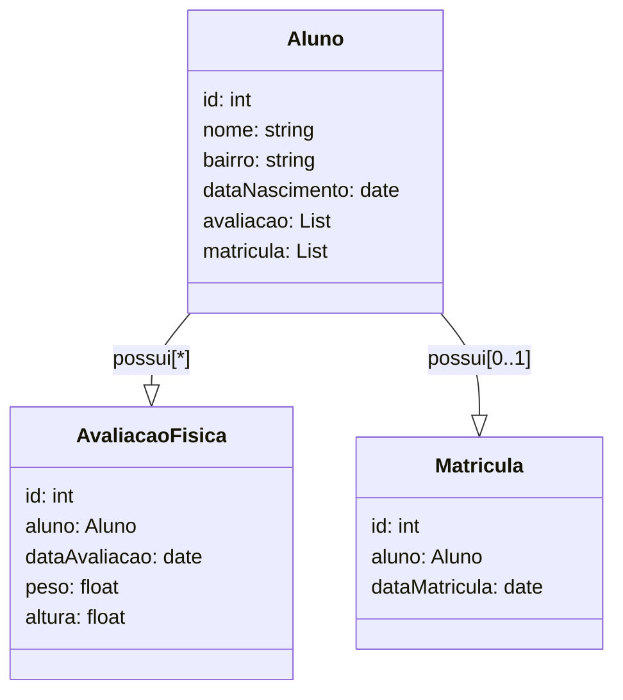

# Desafio Academia de Ginastica

## Tecnologias Utilizadas

* Spring Boot 3.1.5
* Maven 4.0.0
* IDE Eclipse 2023-06
* Postman 10.20.0

## Dependências

* Jpa
* Validation
* Web
* Postgresql
* Lombok
* 

## Descrição

API Rest com Spring Boot e Maven para criação de uma academia digital, onde são cadrastrados alunos, matriculas e avaliações físicas.

## Diagrama de classes

